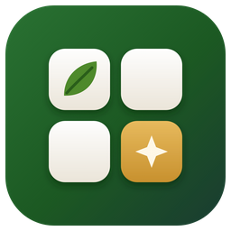
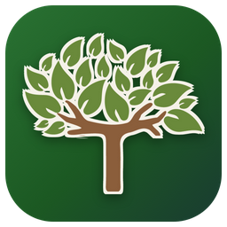
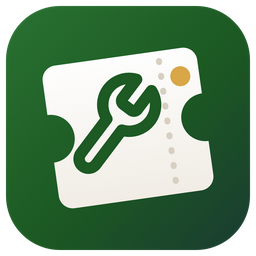
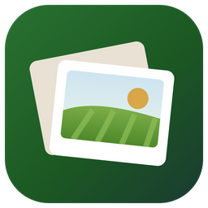

# Christian Brothers apps

Installers for the Christian Brothers Lawncare & Outdoor Services apps, which work with Aspire.

**New computer? Install CB Suite first** — it installs and updates the rest, and shows when there's an update.

###  CB Suite — 1.0.4

*Every app in one place.* Opens, installs and updates the Christian Brothers apps, and shows how Aspire's API is doing. Start here on a new computer.

**[Download the installer](https://github.com/PyrrohX/cb-apps-releases/releases/download/suite-v1.0.4/CB-Suite-Setup-1.0.4.exe)** (79 MB) · released October 7, 2026 · [release notes](https://github.com/PyrrohX/cb-apps-releases/releases/tag/suite-v1.0.4)

---

###  CB Dashboard — 1.0.4

*The office TVs.* Route completion, the snow event board, the weather board, shop status and the welcome wall on every office TV — live from Aspire, with themes, layouts and per-screen settings.

**[Download the installer](https://github.com/PyrrohX/cb-apps-releases/releases/download/dashboard-v1.0.4/CB-Dashboard-Setup-1.0.4.exe)** (78 MB) · released October 7, 2026 · [release notes](https://github.com/PyrrohX/cb-apps-releases/releases/tag/dashboard-v1.0.4)

###  Equipment Requests - Aspire — 1.0.4

*Repair tickets for the shop.* Turn equipment requests from Aspire Mobile into repair tickets with a repair card the mechanic can open, and see the Equipment Repairs route a week at a time.

**[Download the installer](https://github.com/PyrrohX/cb-apps-releases/releases/download/requests-v1.0.4/Equipment-Requests-Aspire-Setup-1.0.4.exe)** (78 MB) · released October 7, 2026 · [release notes](https://github.com/PyrrohX/cb-apps-releases/releases/tag/requests-v1.0.4)

###  Property Photos - Aspire — 1.0.3

*Field photos by property.* Every photo the crews take, by property and work ticket, with a satellite map of where each was taken. Download what you need; it's kept a week.

**[Download the installer](https://github.com/PyrrohX/cb-apps-releases/releases/download/photos-v1.0.3/Property-Photos-Aspire-Setup-1.0.3.exe)** (78 MB) · released October 7, 2026 · [release notes](https://github.com/PyrrohX/cb-apps-releases/releases/tag/photos-v1.0.3)

###  Reference - Aspire — 1.0.4

*Aspire, as easy lists.* Look things up in bulk: every property's square feet, notes and contacts; contracts ending and open bids; plates, service and asset numbers; and the records missing something.

**[Download the installer](https://github.com/PyrrohX/cb-apps-releases/releases/download/reference-v1.0.4/Reference-Aspire-Setup-1.0.4.exe)** (78 MB) · released October 7, 2026 · [release notes](https://github.com/PyrrohX/cb-apps-releases/releases/tag/reference-v1.0.4)

###  Equipment Sales - Aspire — 1.0.1

*Sell old equipment.* Which machines to sell, from their age, meter and repairs in Aspire; a listing for each with photos; where it's listed, offers and the bill of sale; and a for-sale page to share.

**[Download the installer](https://github.com/PyrrohX/cb-apps-releases/releases/download/sales-v1.0.1/Equipment-Sales-Aspire-Setup-1.0.1.exe)** (78 MB) · released October 7, 2026 · [release notes](https://github.com/PyrrohX/cb-apps-releases/releases/tag/sales-v1.0.1)

---

Each app needs the company's Aspire API key the first time it opens (or copies it from CB Dashboard on the same computer); no keys are kept here.
The installers aren't code-signed, so Windows may say *Windows protected your PC* — choose **More info → Run anyway**.

Updated October 7, 2026 · [latest.json](latest.json) is what CB Suite reads.
